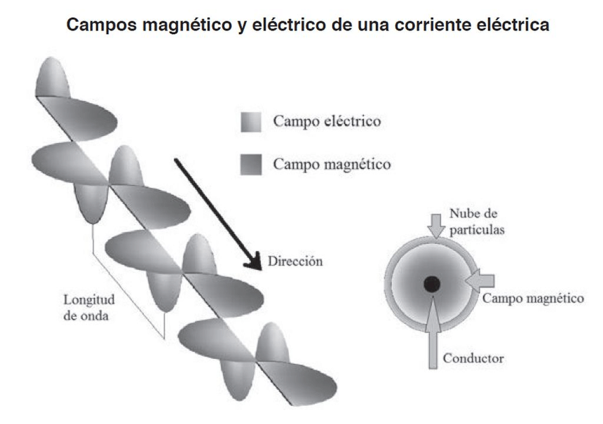

# Que es una onda electromagnética?

Una onda electromagnética es una perturbación del campo eléctrico y magnético, su característica primordial es que se propaga por el espacio transportando energía,también lo puede hacer en el vacío.Principalmente viajan a la velocidad de la luz,no necesitan de algún medio como el agua o el aire para propagarse, ya que esto lo realizan mediante oscilaciones de campos eléctricos y magnéticos, que se mantienen en retroalimentación de lazo cerrado.

# Ecuaciones de Maxwell.

Las ecuaciones de maxwell son un conjunto de cuatro ecuaciones, las cuales tardaron al rededor de 9 años en formularse, ya que fue un conjunto de conocimiento de diferentes científicos como: 

* Johann Carl Friedrich Gauss
* Michael Faraday
* André-Marie Ampère 
* James Clerk Maxwell 

Maxwell científico el cual formula toda una teoría,en 1864 publica **A Dynamical Theory of the Electromagnetic Field** Una teoría dinámica del campo electromagnético.Con este conjunto de las cuatro ecuaciones de maxwell se explica cualquier fenómeno electromagnético.

## Johann Carl Friedrich Gauss
1.-Ley Campo electrico

El flujo de un campo eléctrico a traves de una superficie cerrada, es igual a la razón de la carga encerrada en esa superficie y la permitividad del vacío.

Forma integral:

$$
\oint_S \vec{E}\cdot d\vec{A}=\frac{Q_{\mathrm{enc}}}{\varepsilon_0}
$$

**Donde:**

- $Q_{\mathrm{enc}}$: carga encerrada dentro de la superficie.
- $\varepsilon_0$: permitividad eléctrica del vacío.

Forma diferencial:

$$
\nabla \cdot \vec{E} = \frac{\rho}{\varepsilon_0}
$$

2.- Ley de campo magnetico

Un campó  magnético es una region del espacio donde una carga en movimiento experimenta una fuerza.Se denota **B** y se mide en Teslas.

Forma integral

El flujo que atraviesa cualquier superficie cerrada siempre sera igual a cero.

$$
\oint_S \vec{B}\cdot d\vec{A} = 0
$$

Forma diferencial

La divergencia del campo magnético siempre sera cero en todo punto del espacio.

$$
\nabla \cdot \vec{B} = 0
$$

## Michael Faraday

Ley de faraday

Describe como un campo magnético que cambia en el tiempo genera un campo eléctrico.

Forma Integral

$$
\oint_C \vec{E}\cdot d\vec{l}=-\frac{d\Phi_B}{dt}
$$

**Donde:**

$$
\Phi_B=Flujo magnético
$$

$$
\Phi_B=\int_S \vec{B}\cdot d\vec{A}
$$

Ley de lenz

El campo eléctrico inducido se opone al cambio de flujo que lo genera.

$$
-\frac{d\Phi_B}{dt}
$$

Forma diferencial

El rotacional del campo eléctrico es igual a la derivada temporal del campo magnético en ese mismo punto.

$$
\nabla \times \vec{E}=-\frac{\partial \vec{B}}{\partial t}
$$

## André-Marie Ampère y James Clerk Maxwell

Ley de Ampere-Maxwell 

Esta ley principalmente describe como se genera un campo magnético a traves de una corriente como por un campo eléctrico que cambia en el tiempo.

$$
\oint_C \vec{B}\cdot d\vec{l}=\mu_0 I_{\mathrm{enc}}+\mu_0\varepsilon_0\frac{d\Phi_E}{dt}
$$

**Donde:**

$$
\Phi_E=Flujo electrico
$$

$\varepsilon_0$: permitividad eléctrica del vacío.
$\mu_0$: permeabilidad magnética del vacío.

$$
\Phi_E=\int_S \vec{E}\cdot d\vec{A}
$$

Forma diferencial

$$
\nabla\times\vec{B}=\mu_0\vec{J}+\mu_0\varepsilon_0\frac{\partial\vec{E}}{\partial t}
$$

**Donde:**

* $\nabla\times\vec{A}$: rotacional del campo A.
* $\vec{B}$: campo magnético.
* $\mu_0$: permeabilidad magnética del vacío.
* $\vec{J}$: densidad de corriente eléctrica.
* $\varepsilon_0$: permitividad eléctrica del vacío.
* $\frac{\partial\vec{E}}{\partial t}$: variación temporal del campo eléctrico.

Estas cuatro ecuaciones en conjunto forman toda la estructura electromagnética que nos ayuda a entender como se conforma el mundo de las comunicaciones.

# Derivación de la ecuación de onda para los campos Eléctrico y Magnético

Partimos de las ecuaciones de Maxwell en el vacío.

$$
\begin{aligned}
\nabla \cdot \vec{E} &= 0 \\
\nabla \cdot \vec{B} &= 0  \\
\nabla \times \vec{E} &= -\frac{\partial \vec{B}}{\partial t} \\
\nabla \times \vec{B} &= \mu_0 \varepsilon_0 \frac{\partial \vec{E}}{\partial t}
\end{aligned}
$$

Entonces aplicamos el rotacional a la ley de Michael Faraday

$$
\begin{aligned}
\nabla \times (\nabla \times \vec{E}) &= \nabla \times \left(-\frac{\partial \vec{B}}{\partial t}\right)
\end{aligned}
$$

debemos tener en cuenta la siguiente formula **Identidad del doble rotacional**

$$
\begin{aligned}
\text{Doble rotacional:} \quad \nabla \times (\nabla \times \vec{E}) &= \nabla(\nabla \cdot \vec{E}) - \nabla^2 \vec{E}
\end{aligned}
$$

y como nos encontramos en el vacio sabemos que

$$
\nabla \cdot \vec{E} = 0
$$

eentonces nuestra igualación queda de la siguiente forma:

$$
\nabla \times (\nabla \times \vec{E}) = - \nabla^2 \vec{E}
$$

Ahora de nuestra segunda igualdad intercambiamos el orden de las derivadas

$$
\nabla \times \left(\frac{\partial \vec{B}}{\partial t}\right)
$$

se aplica igualdad de las derivadas mixtas **teorema de Schwarz**

$$
\nabla \times \left(\frac{\partial \vec{B}}{\partial t}\right) = -\frac{\partial}{\partial t}(\nabla \times \vec{B})
$$

Posterior a ello sabemos por la ley de Ampére-Maxwell que 

$$
\nabla \times \vec{B} = \mu_0 \varepsilon_0 \frac{\partial \vec{E}}{\partial t}
$$

Sutituimos en la igualdad obtenida

$$
\begin{aligned}
\frac{\partial}{\partial t}(\nabla \times \vec{B})=\frac{\partial}{\partial t} \left( \mu_0 \varepsilon_0 \frac{\partial \vec{E}}{\partial t} \right) = -\mu_0 \varepsilon_0 \frac{\partial^2 \vec{E}}{\partial t^2}
\end{aligned}
$$

Y juntando nuestra igualdad

$$
\begin{aligned}
\nabla^2 \vec{E}=-\mu_0 \varepsilon_0 \frac{\partial^2 \vec{E}}{\partial t^2}
\end{aligned}
$$

y multiplicamos por -1 ambas partes de la igualdad y obtenemos

Ecuacion de onda para el campo electrico

$$
\begin{aligned}
\nabla^2 \vec{E}=\mu_0 \varepsilon_0 \frac{\partial^2 \vec{E}}{\partial t^2}
\end{aligned}
$$

siguiendo el mismo razonamiento se realiza el proceso partiendo de la ley de Ampere-Maxwell y se obtiene :

$$
\begin{aligned}
\nabla^2 \vec{B}=\mu_0 \varepsilon_0 \frac{\partial^2 \vec{B}}{\partial t^2}
\end{aligned}
$$

y de esta forma obtuvimos las ecuaciones de onda para el campo electrico como para el campo magnetico.

# Velocidad de propagacion

Partimos de la ecuacion de onda para el campo electrico que obtuvimos

$$
\begin{aligned}
\nabla^2 \vec{E} &= \mu_0 \varepsilon_0 \frac{\partial^2 \vec{E}}{\partial t^2}
\end{aligned}
$$

para simplificar los calculos vamos a trabajar con una onda que viaja en una sola direccion x y cuyo campo electrico siempre apunta al eje y.

Onda plana:

$$
\begin{aligned}
\vec{E} &= E_y(x,t) \hat{y} \\
\end{aligned}
$$

y como no depende de y ni de z, el laplaciano completo se reduce a una sola derivada

$$
\begin{aligned}
\frac{\partial^2 E_y}{\partial x^2} &= \mu_0 \varepsilon_0 \frac{\partial^2 E_y}{\partial t^2} 
\end{aligned}
$$

Vamos a utilizar la ecuacion de onda generica

$$
\begin{aligned}
\frac{\partial^2 f}{\partial x^2} &= \frac{1}{v^2} \frac{\partial^2 f}{\partial t^2} \\
\mu_0 \varepsilon_0 &= \frac{1}{v^2} \\
\end{aligned}
$$

y realizamos comparacion 

$$
\begin{aligned}
\frac{\partial^2 E_y}{\partial x^2} &= \mu_0 \varepsilon_0 \frac{\partial^2 E_y}{\partial t^2} \\
\frac{\partial^2 f}{\partial x^2} &= \frac{1}{v^2} \frac{\partial^2 f}{\partial t^2} \\
\end{aligned}
$$

y obtenemos 

$$
\begin{aligned}
\mu_0 \varepsilon_0 &= \frac{1}{v^2} \\
\end{aligned}
$$

Despejamos la formula obtenida y finalmente obtenemos un valor para la velocidad

$$
\begin{aligned}
v^2 &= \frac{1}{\mu_0 \varepsilon_0} \\
v &= \frac{1}{\sqrt{\mu_0 \varepsilon_0}}
\end{aligned}
$$
 
Valores de permeabilidad y pemitividad en el vacio

$$
\begin{aligned}
\text{\textbf{Permeabilidad magnética del vacío:}} \quad \mu_0 &= 4\pi \times 10^{-7} \text{ N/A}^2 \approx 1.2566 \times 10^{-6} \text{ N/A}^2 \\
\text{\textbf{Permitividad eléctrica del vacío:}} \quad \varepsilon_0 &\approx 8.854187 \times 10^{-12} \text{ F/m}
\end{aligned}
$$

Sustituyendo los valores de permeabilidad y permitividad

$$
\begin{aligned}
v &= \frac{1}{\sqrt{\mu_0 \varepsilon_0}} \\
v &= \frac{1}{\sqrt{\left(4\pi \times 10^{-7} \text{ N/A}^2\right) \left(8.854187 \times 10^{-12} \text{ F/m}\right)}} \\
v &= \frac{1}{\sqrt{1.11265 \times 10^{-17} \text{ s}^2/\text{m}^2}} \\
v &\approx \frac{1}{3.33564 \times 10^{-9} \text{ s/m}} \\
v &\approx 299\,792\,458 \text{ m/s} \approx 3 \times 10^8 \text{ m/s} = c
\end{aligned}
$$

# Solucion de onda viajera

Propuesta de solución para la onda viajera

$$
\begin{aligned}
E_y(x,t) &= E_0 \sin(kx - \omega t) \\
\end{aligned}
$$

Calculamos la segunda derivada temporal 
$$
\begin{aligned}
\frac{\partial E_y}{\partial x} &= k E_0 \cos(kx - \omega t) \\
\frac{\partial^2 E_y}{\partial x^2} &= -k^2 E_0 \sin(kx - \omega t) \\
\end{aligned}
$$

Calculamos la segunda derivada espacial
$$
\begin{aligned}
\frac{\partial E_y}{\partial t} &= -\omega E_0 \cos(kx - \omega t) \\
\frac{\partial^2 E_y}{\partial t^2} &= -\omega^2 E_0 \sin(kx - \omega t) \\
\end{aligned}
$$

Sustituimos en la ecuacion de onda

$$
\begin{aligned}
\frac{\partial^2 E_y}{\partial x^2} = \frac{1}{c^2} \frac{\partial^2 E_y}{\partial t^2} \\
-k^2 E_0 \sin(kx - \omega t) &= \frac{1}{c^2} \left[ -\omega^2 E_0 \sin(kx - \omega t) \right] \\
\end{aligned}
$$

Finalmente Simplificamos 

$$
\begin{aligned}
-k^2 &= -\frac{\omega^2}{c^2} \\
k^2 &= \frac{\omega^2}{c^2} \quad \implies \quad k = \frac{\omega}{c} \quad \text{o} \quad c = \frac{\omega}{k}
\end{aligned}
$$

Valores obtenidos:

$$
\begin{aligned}

k \quad &\rightarrow \quad \text{\textbf{Número de onda angular}} \quad \left( k = \frac{2\pi}{\lambda}, \text{ en rad/m} \right) \\
\omega \quad &\rightarrow \quad \text{\textbf{Frecuencia angular}} \quad \left( \omega = 2\pi f, \text{ en rad/s} \right) \\
c \quad &\rightarrow \quad \text{\textbf{Velocidad de propagación de la luz en el vacío}} \quad \left( c \approx 3 \times 10^8 \text{ m/s} \right)
\end{aligned}
$$

# Relación fundamental entre velocidad, longitud de onda y frecuencia

Primero partimos de la relacion de dispersion 

$$
\begin{aligned}
k &= \frac{\omega}{c} \quad \implies \quad c = \frac{\omega}{k} \\
\end{aligned}
$$

Despues sustituimos las definiciones de las variables

$$
\begin{aligned}
\omega &= 2\pi f \quad \text{(Frecuencia angular en rad/s)} \\
k &= \frac{2\pi}{\lambda} \quad \text{(Número de onda angular en rad/m)} \\
\end{aligned}
$$

Y sustituimos en nuestra variable que relaciona ambas a formulas y es la luz

$$
\begin{aligned}
c &= \frac{2\pi f}{\left(\dfrac{2\pi}{\lambda}\right)} \\
\end{aligned}
$$

Simplificamos la relacion obtenida 

$$
\begin{aligned}
c &= \frac{2\pi f \cdot \lambda}{2\pi} \\
\end{aligned}
$$

Cancelamos el factor comun
$$
\begin{aligned}
c &= \lambda \cdot f
\end{aligned}
$$

Esta relacion obtenida es fundamental para poder entender lo que es el Infrarrojo ya que esta relacion explica excatamente como es que una onda electromagnetica se propaga en el vacio y dependiendo a su frecuencia es como se clasificara ese tipo de onda como se vera en el siguiente capitulo

$$
\begin{aligned}
f &= \frac{c}{\lambda}
\end{aligned}
$$